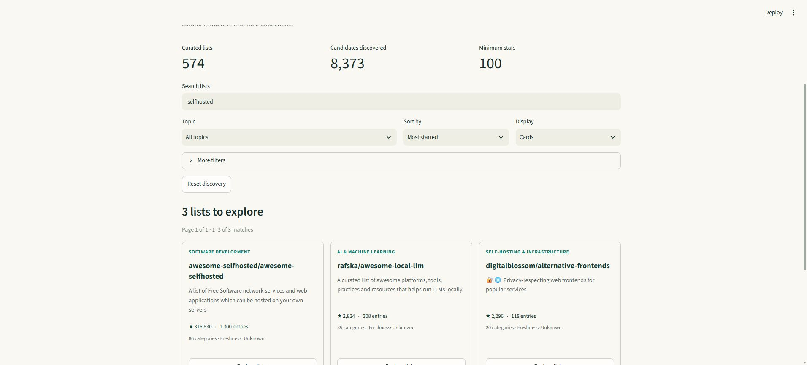

# AwesomeAwesomeness

Discover and explore **Awesome lists themselves**, from self-hosting to science. Public repository discovery starts at **100 observed GitHub stars**; curated-list eligibility is evaluated separately. All crawling and processing runs locally. The free Streamlit website reads a versioned snapshot.

[Open the live application](https://awesomeawesomeness.streamlit.app/) ·
[Releases](https://github.com/smota/agentflow-demo/releases) ·
[2.0 delivery journal](docs/demo/wave2.md)

The public app is deployed independently of this computer. The current checkout
version is in package.json; the running version and catalogue digest appear in
the app footer. Release closeout is recorded in the linked GitHub workstream.



Actual local design-stage screenshot, not a deployment claim. The live footer identifies the running version and data digest.

- [Approved goal and acceptance matrix](docs/demo/goal.md)
- [Delivery story](docs/demo/story.md)
- [Recovery and operating instructions](docs/demo/runbook.md)
- [List data and coverage](docs/demo/list-data.md)
- [Current GitHub workstream](https://github.com/smota/agentflow-demo/issues/16)

## Agentflow baseline

This wave uses Agentflow's merged development revision
`60a0e800dc4d4ce9476c72231a0b853998131213`, pinned in `agentflow-source.json`.
It is an **unreleased integration revision**, not a claimed published Agentflow 2.0
release. The [journal](docs/demo/wave2.md) records adoption, advisory councils,
typed acceptance, actual rework, tests and recovery. Agentflow supplies the process;
AI-assisted execution requires a supported client and any required subscription or API access.

Run the stack-independent governance checks with Node.js 24 after preparing the exact
project-local source checkout as described in the [runbook](docs/demo/runbook.md):

```sh
npm run check:workflow
```

## Run the app

Use Python 3.11 in a project-local environment. From this repository in PowerShell:

```powershell
$demoRoot = (Get-Location).Path
New-Item -ItemType Directory -Force .cache/tmp, .cache/pip | Out-Null
$env:TEMP = Join-Path $demoRoot '.cache/tmp'
$env:TMP = $env:TEMP
$env:PIP_CACHE_DIR = Join-Path $demoRoot '.cache/pip'
$env:PYTHONDONTWRITEBYTECODE = '1'
python -m venv .venv
.venv/Scripts/python.exe -m pip install -r requirements.txt
.venv/Scripts/python.exe -m streamlit run app.py --server.address=127.0.0.1
```

For tests/local ingestion, use the same cache environment and install the locked
development dependencies instead:

```powershell
.venv/Scripts/python.exe -m pip install -r requirements-dev.txt
```

On POSIX, use `.venv/bin/python` and equivalent project-local environment variables.
The crawler is
never imported by the hosted entrypoint. No API key or model is needed.

```sh
.venv/Scripts/python.exe -m pytest -q --basetemp=.cache/pytest
.venv/Scripts/python.exe -m tools.lists validate
.venv/Scripts/python.exe -m tools.lists discover --run-id lists-YYYYMMDD
.venv/Scripts/python.exe -m tools.lists enrich --run-id lists-YYYYMMDD
# Review the staged index, source provenance and exact digest first.
.venv/Scripts/python.exe -m tools.lists publish --expected-digest <reviewed-digest>
```

Local crawling requires an authenticated GitHub CLI (`gh`); it never prints tokens.
Set TEMP/TMP and install caches within the project as described in the runbook.
The generated candidate is not deployed until committed and promoted through PRs.

## Preview coverage

The early list-first snapshot includes **1,510 eligible lists** among **8,373
discovered candidates**, including awesome-selfhosted and 15 lists observed at exactly
100 stars. It is intentionally partial: 5,326 candidates still await content enrichment;
others may need stronger curation evidence or use unsupported formats. Pending is
not excluded, and unknown is not zero. See the app's coverage panel and data contract.

Search list scope/topics, filter and paginate the whole catalogue, open original
categories and search within a collection. Table links lead to upstream content and
its pinned source. Shared views preserve discovery and in-list filters; shared URLs
include search text. Stars and the optional freshness index are not quality scores.
Contributor counts and content freshness stay unknown until actually observed.
No invented trends, complete README republication, hosted crawler or AI service.
