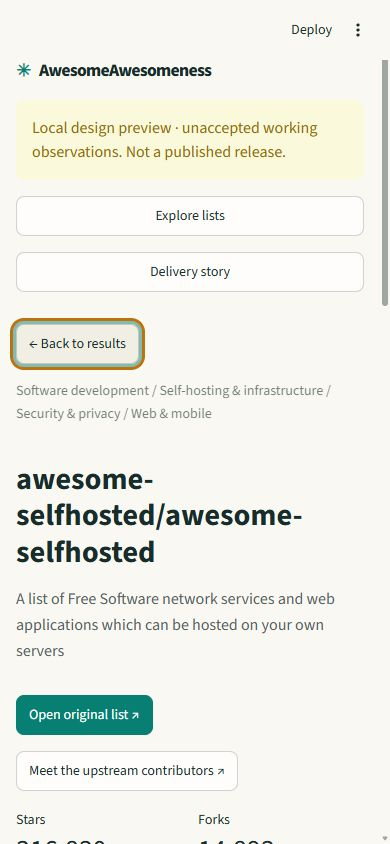

# List-first preview: local design evidence

This chapter records a **local, unaccepted working preview**, not the public app.
The initial browser snapshot used generation `dbf748c60e42`: 574 eligible lists
among 8,373 discovered candidates. The production data acceptance is a separate gate.

The new experience focuses on the lists themselves: topic/scope discovery, minimum
stars, curation and freshness filters, paginated cards or a table, original taxonomy,
in-list search and direct source links. Unknown metrics remain visibly unknown.
The recognizable cream, green and editorial typography carry forward from v1.

Browser exploration found selfhosted, opened its profile and filtered its 1,300
indexed entries to three Nextcloud matches. At 390px, the page had no horizontal
overflow. Native keyboard actions worked and visible focus was preserved. The
mobile KPI layout was tightened into a two-column grid.

A read-only advisory council found two real correctness gaps: section provenance
was not fully bound to the source revision, and shared views omitted in-list filters.
Both were fixed with corruption and complete-roundtrip tests. The source validation
fix was also adopted by the ingestion increment. Seven new offline UI/state tests
pass; the complete contained preview checkout has 127 passing tests at this checkpoint.
No credentials or network are needed by these tests or the hosted reader.

The council is agent advice, not human approval. Public alpha publication and
independent public behavior/version/digest verification remain required.
