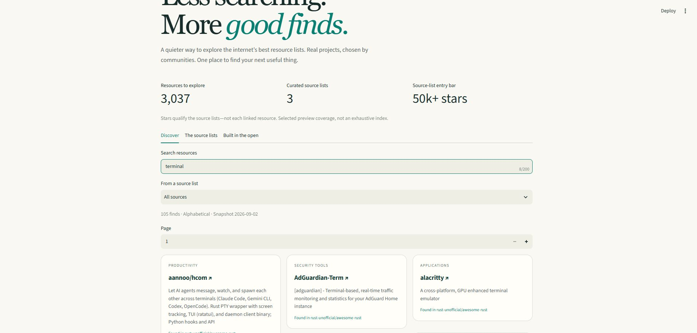
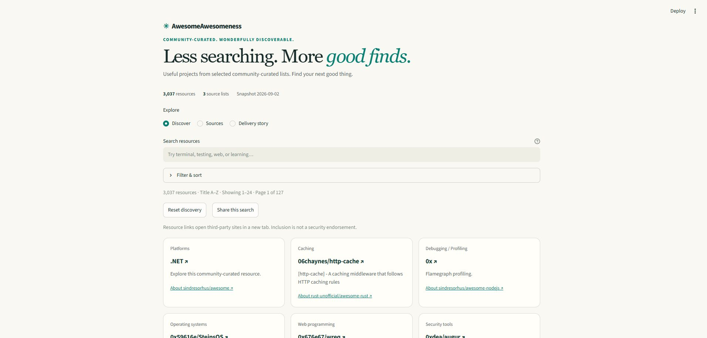
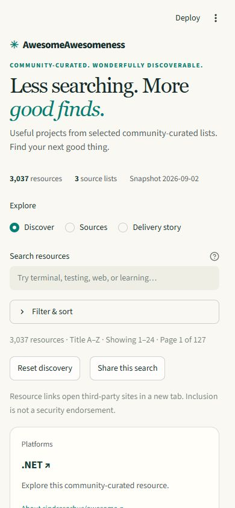

# Building AwesomeAwesomeness

This story records actual execution, including limitations and failed checks. It does not treat plans, simulations or local checks as public-release evidence.

## 1. Before the first feature

The starting repository was empty. Read-only readiness checks verified GitHub permissions and the authenticated Streamlit deployment form. An actual disposable pip installation of Streamlit 1.63.0, pytest 9.1.1 and markdown-it-py 4.2.0 succeeded; pip check and a Streamlit AppTest passed after correcting a Windows quoting error in the test harness. Test environments were removed.

Activation created [the delivery epic](https://github.com/smota/agentflow-demo/issues/1) and [foundation issue](https://github.com/smota/agentflow-demo/issues/2). An empty baseline commit established main and development without placing implementation on a protected branch.

## 2. A real capability boundary

The current Agentflow source differed from its latest published release. Current adoption requires a receipt outside the target, conflicting with the demo's folder-only constraint. The verified v1.0.0 release instead provides a supported init command. The demo uses that release, pinned to d61b3ca71189f872a6fd78373076f2aab787f2e0, and records the distinction rather than claiming unreleased capabilities.

Installation placed 335 framework files plus three seed files in the project. Application-specific configuration and recovery instructions are project-owned. The framework source repository was not modified.

## 3. Review returned work, not a rubber stamp

A same-platform, fresh-context advisory reviewer identified two foundation gaps:
missing exact recovery commands and upstream license attribution. The accountable
Codex reviewer returned phase 6 to implementation. Both were repaired before PR
readiness. The [signed handover](https://github.com/smota/agentflow-demo/issues/2#issuecomment-5515259055)
records the return; no real human approval is implied.

The workstation's npm wrapper printed guidance without running tests. Direct use
of the installed npm CLI then ran the actual workflow checks successfully. This
is a harness-aware fallback, not a bypass of a failed validator.

## 4. A real-data preview before polish

The [architecture council](architecture.md) used two fresh-context, read-only Codex
seats. Their objections became implementation requirements: actual license review,
safe token extraction, complete attribution and resource budgets. Static JSON won;
live hosted crawling was rejected because it violated the local-only contract.

The generic capability resolver initially refused a council because delegation was
not declared. This actual desktop harness had already demonstrated a helper, so
the project registered that capability and reran resolution successfully. This is
an environment-specific declaration, not a universal claim about Codex.

Two GitHub searches discovered 39 candidates. Three independently qualified CC0
lists produced 3,037 unique resources from 3,058 source occurrences. The
[source review](source-review.md) pins revisions, licenses and the accepted digest.
Thirty-one tests pass, including offline AppTest, unsafe URLs, parser fixtures,
threshold boundaries and rejection of a stale publication digest. The browser
separately verified 105 terminal-search results and the empty state.

This screenshot is actual local execution, not a mockup or proof of public hosting.
The first UI intentionally leaves density, filters and shareable journeys for #5.

## 5. CI found what the warm workspace hid

The first Linux [preview CI run](https://github.com/smota/agentflow-demo/actions/runs/33677222773)
passed 30 tests but failed one fixture: the configured test-temp parent did not
exist on a fresh checkout. PR readiness returned to implementation rather than
waiving the failure. The test harness now creates its contained parent and refuses
temporary paths outside the project's cache. This is a real failure/rework path.

## 6. Publish early—and verify the setting, not the click

[v0.1.0](https://github.com/smota/agentflow-demo/releases/tag/v0.1.0) is live at
[AwesomeAwesomeness](https://awesomeawesomeness.streamlit.app/). The deployment
form defaulted to Python 3.14. An initial semantic selection did not persist;
the action guard stopped deployment. Inspection of the visible menu, followed by
reopening the saved settings, confirmed Python 3.11 before submission. No guard
was bypassed. The deployed app independently showed the expected version and
catalogue digest, 105 terminal matches and the empty state. It still served 546
rust matches after the local server was stopped.

## 7. A council changes the experience

The [UX council](ux-decisions.md) used two fresh-context read-only Codex advisors,
simulating designer and UX/QA stakeholders—not actual human reviewers. The real
mobile baseline exposed overlapping host controls and search below the first
screen. Code inspection also found column-major keyboard order and misleading
first-occurrence metadata. These findings became implementation and regression
tests, not cosmetic approval.

The refined layout uses a compact hero, inline statistics, native expandable
filters and one row-ordered semantic grid. Source and topic must match the same
occurrence. Sharing is deliberate: a warning explains that query text goes into
the link. No automatic secret-detection claim is made.

These are actual local v0.2 candidate screenshots. Forty-eight tests pass,
including offline AppTest, URL normalization, reset, view persistence and page
bounds. Real browser checks at 320 and 390 pixels found no horizontal overflow;
keyboard Enter applied search and Tab reached the native filter disclosure.

The [v0.2.0 release](https://github.com/smota/agentflow-demo/releases/tag/v0.2.0)
and hosted mobile layout were subsequently verified at main commit
`9a62a713f45c6f3701211e421591fba1626952b9`, with the unchanged catalogue digest.

## 8. Stop, reconstruct, resume

The [recovery exercise](recovery-results.md) deliberately exited the local
crawler after its first saved source. Resume verified that source and completed
the remaining two; repeated replay produced the same 3,037 resources and digest.
Published bytes never changed. After a code refinement, the older checkpoint
was correctly rejected for engine mismatch; a new named run passed again.

Next, the parent froze changes and gave a fresh-context read-only Codex helper
only the repository location and recovery instructions. Without conversation or
scratch, it recovered the exact issue, branch, commit, findings and next action
from committed files and GitHub. All five matched. The parent then resumed and
reran 67 tests. This demonstrates recoverable workflow evidence—not an OS crash,
human review, or cross-platform role alternation.

The [v0.3.0 release](https://github.com/smota/agentflow-demo/releases/tag/v0.3.0)
was verified against main commit `ac4a81cb07e23cc6e60f0f2f737c7d7bce051a77`
and the actual public footer, independently of the local recovery exercise.

## 9. The final council still finds something real

Three fresh-context read-only [release advisors](release-council.md) covered QA,
operations and evidence integrity. One found a concrete mismatch: crates.io's
Registries occurrence was called Crates, but the UI still used the canonical
Cargo title from another section. A committed regression failed on Cargo, then
passed after matching, displaying and sorting one coherent occurrence. The
catalogue bytes did not need to change.

Operations caught a documentation gap: pip's cache was not explicitly contained
by the installation commands. QA required complete share/provenance and keyboard
journeys, not only screenshot inspection. Those became [exploratory checks](exploratory-qa.md),
an automated generated-link roundtrip and guarded [run/rollback instructions](runbook.md).
The suite now has 72 tests. Stakeholders remain explicitly simulated; these are
actual advisory contexts, not fabricated human approvals.

A final browser check exposed stale local runtime behavior while fresh-process
tests passed. Review withdrew a premature browser-pass summary and returned the
work. Restarting the server, without another code change, made the exact Crates
query pass. The [QA record](exploratory-qa.md) retains both observations. An updated
version footer alone is not proof that every imported module is fresh.

## Follow the evidence

| Cycle | Work and publication |
| --- | --- |
| Foundation | [Issue #2](https://github.com/smota/agentflow-demo/issues/2), [PR #3](https://github.com/smota/agentflow-demo/pull/3), review return and repaired setup |
| Early preview | [Issue #4](https://github.com/smota/agentflow-demo/issues/4), [PR #8](https://github.com/smota/agentflow-demo/pull/8), [v0.1.0](https://github.com/smota/agentflow-demo/releases/tag/v0.1.0) |
| UX | [Issue #5](https://github.com/smota/agentflow-demo/issues/5), [PR #10](https://github.com/smota/agentflow-demo/pull/10), [v0.2.0](https://github.com/smota/agentflow-demo/releases/tag/v0.2.0) |
| Recovery | [Issue #6](https://github.com/smota/agentflow-demo/issues/6), [PR #12](https://github.com/smota/agentflow-demo/pull/12), [v0.3.0](https://github.com/smota/agentflow-demo/releases/tag/v0.3.0) |
| Acceptance | [Issue #7](https://github.com/smota/agentflow-demo/issues/7), [PR #14](https://github.com/smota/agentflow-demo/pull/14), [candidate](https://github.com/smota/agentflow-demo/releases/tag/v1.0.0-rc.1), [stable release](https://github.com/smota/agentflow-demo/releases/tag/v1.0.0), [acceptance matrix](acceptance.md) |

## 10. Candidate and stable are separate gates

The verified candidate was tagged `v1.0.0-rc.1` at
`4b2130e95413919a7dbc166d25a563c570b6c0c9` after local checks, review and
all required PR checks. It was explicitly a feature-branch prerelease, not a
claim of hosted RC or stable acceptance. The planned readiness gate returned to
implementation for the stable version/notes, followed by repeated validation.
No feature, catalogue or dependency changed between candidate and stable code.

The [stable release](https://github.com/smota/agentflow-demo/releases/tag/v1.0.0)
and [final issue receipt](https://github.com/smota/agentflow-demo/issues/7) hold the
post-promotion commit/tag/hosted checks. This avoids pretending that publication
was already verified when the release commit was written.

Final publication is not inferred from this narrative. The final issue and
GitHub release retain exact commit/tag/data/hosted checks after they execute.
No heartbeat or operating-system scheduler was installed.
