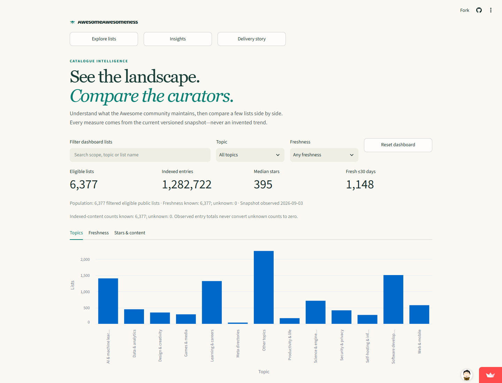
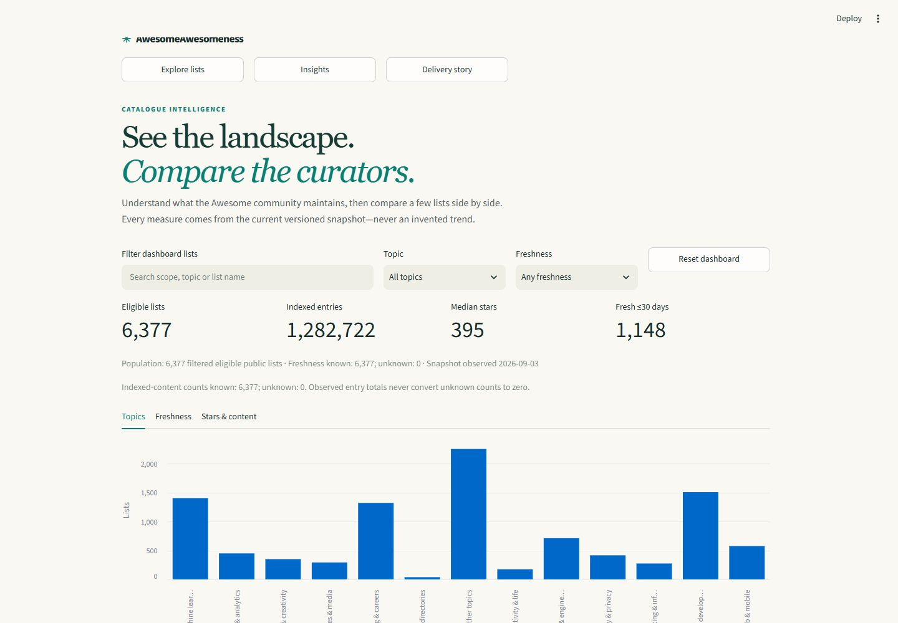
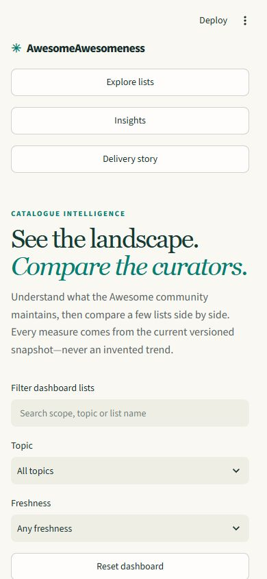

# Building AwesomeAwesomeness

This story records actual execution, including limitations and failed checks. It does not treat plans, simulations or local checks as public-release evidence.

## 1. Before the first feature

The starting repository was empty. Read-only readiness checks verified GitHub permissions and the authenticated Streamlit deployment form. An actual disposable pip installation of Streamlit 1.63.0, pytest 9.1.1 and markdown-it-py 4.2.0 succeeded; pip check and a Streamlit AppTest passed after correcting a Windows quoting error in the test harness. Test environments were removed.

Activation created [the delivery epic](https://github.com/smota/agentflow-demo/issues/1) and [foundation issue](https://github.com/smota/agentflow-demo/issues/2). An empty baseline commit established main and development without placing implementation on a protected branch.

## 2. A real capability boundary

The current Agentflow source differed from its latest published release. Current adoption requires a receipt outside the target, conflicting with the demo's folder-only constraint. The verified v1.0.0 release instead provides a supported init command. The demo uses that release, pinned to d61b3ca71189f872a6fd78373076f2aab787f2e0, and records the distinction rather than claiming unreleased capabilities.

Installation placed 335 framework files plus three seed files in the project. Application-specific configuration and recovery instructions are project-owned. The framework source repository was not modified.

## 3. Review returned work, not a rubber stamp

A same-platform, fresh-context advisory reviewer identified two foundation gaps:
missing exact recovery commands and upstream license attribution. The accountable
Codex reviewer returned phase 6 to implementation. Both were repaired before PR
readiness. The [signed handover](https://github.com/smota/agentflow-demo/issues/2#issuecomment-5515259055)
records the return; no real human approval is implied.

The workstation's npm wrapper printed guidance without running tests. Direct use
of the installed npm CLI then ran the actual workflow checks successfully. This
is a harness-aware fallback, not a bypass of a failed validator.

## 4. A real-data preview before polish

The [architecture council](architecture.md) used two fresh-context, read-only Codex
seats. Their objections became implementation requirements: actual license review,
safe token extraction, complete attribution and resource budgets. Static JSON won;
live hosted crawling was rejected because it violated the local-only contract.

The generic capability resolver initially refused a council because delegation was
not declared. This actual desktop harness had already demonstrated a helper, so
the project registered that capability and reran resolution successfully. This is
an environment-specific declaration, not a universal claim about Codex.

Two GitHub searches discovered 39 candidates. Three independently qualified CC0
lists produced 3,037 unique resources from 3,058 source occurrences. The
[source review](source-review.md) pins revisions, licenses and the accepted digest.
Thirty-one tests pass, including offline AppTest, unsafe URLs, parser fixtures,
threshold boundaries and rejection of a stale publication digest. The browser
separately verified 105 terminal-search results and the empty state.

This screenshot is actual local execution, not a mockup or proof of public hosting.
The first UI intentionally leaves density, filters and shareable journeys for #5.

## 5. CI found what the warm workspace hid

The first Linux [preview CI run](https://github.com/smota/agentflow-demo/actions/runs/33677222773)
passed 30 tests but failed one fixture: the configured test-temp parent did not
exist on a fresh checkout. PR readiness returned to implementation rather than
waiving the failure. The test harness now creates its contained parent and refuses
temporary paths outside the project's cache. This is a real failure/rework path.

## 6. Publish early—and verify the setting, not the click

[v0.1.0](https://github.com/smota/agentflow-demo/releases/tag/v0.1.0) is live at
[AwesomeAwesomeness](https://awesomeawesomeness.streamlit.app/). The deployment
form defaulted to Python 3.14. An initial semantic selection did not persist;
the action guard stopped deployment. Inspection of the visible menu, followed by
reopening the saved settings, confirmed Python 3.11 before submission. No guard
was bypassed. The deployed app independently showed the expected version and
catalogue digest, 105 terminal matches and the empty state. It still served 546
rust matches after the local server was stopped.

## 7. A council changes the experience

The [UX council](ux-decisions.md) used two fresh-context read-only Codex advisors,
simulating designer and UX/QA stakeholders—not actual human reviewers. The real
mobile baseline exposed overlapping host controls and search below the first
screen. Code inspection also found column-major keyboard order and misleading
first-occurrence metadata. These findings became implementation and regression
tests, not cosmetic approval.

The refined layout uses a compact hero, inline statistics, native expandable
filters and one row-ordered semantic grid. Source and topic must match the same
occurrence. Sharing is deliberate: a warning explains that query text goes into
the link. No automatic secret-detection claim is made.

These are actual local v0.2 candidate screenshots. Forty-eight tests pass,
including offline AppTest, URL normalization, reset, view persistence and page
bounds. Real browser checks at 320 and 390 pixels found no horizontal overflow;
keyboard Enter applied search and Tab reached the native filter disclosure.

The [v0.2.0 release](https://github.com/smota/agentflow-demo/releases/tag/v0.2.0)
and hosted mobile layout were subsequently verified at main commit
`9a62a713f45c6f3701211e421591fba1626952b9`, with the unchanged catalogue digest.

## 8. Stop, reconstruct, resume

The [recovery exercise](recovery-results.md) deliberately exited the local
crawler after its first saved source. Resume verified that source and completed
the remaining two; repeated replay produced the same 3,037 resources and digest.
Published bytes never changed. After a code refinement, the older checkpoint
was correctly rejected for engine mismatch; a new named run passed again.

Next, the parent froze changes and gave a fresh-context read-only Codex helper
only the repository location and recovery instructions. Without conversation or
scratch, it recovered the exact issue, branch, commit, findings and next action
from committed files and GitHub. All five matched. The parent then resumed and
reran 67 tests. This demonstrates recoverable workflow evidence—not an OS crash,
human review, or cross-platform role alternation.

The [v0.3.0 release](https://github.com/smota/agentflow-demo/releases/tag/v0.3.0)
was verified against main commit `ac4a81cb07e23cc6e60f0f2f737c7d7bce051a77`
and the actual public footer, independently of the local recovery exercise.

## 9. The final council still finds something real

Three fresh-context read-only [release advisors](release-council.md) covered QA,
operations and evidence integrity. One found a concrete mismatch: crates.io's
Registries occurrence was called Crates, but the UI still used the canonical
Cargo title from another section. A committed regression failed on Cargo, then
passed after matching, displaying and sorting one coherent occurrence. The
catalogue bytes did not need to change.

Operations caught a documentation gap: pip's cache was not explicitly contained
by the installation commands. QA required complete share/provenance and keyboard
journeys, not only screenshot inspection. Those became [exploratory checks](exploratory-qa.md),
an automated generated-link roundtrip and guarded [run/rollback instructions](runbook.md).
The suite now has 72 tests. Stakeholders remain explicitly simulated; these are
actual advisory contexts, not fabricated human approvals.

A final browser check exposed stale local runtime behavior while fresh-process
tests passed. Review withdrew a premature browser-pass summary and returned the
work. Restarting the server, without another code change, made the exact Crates
query pass. The [QA record](exploratory-qa.md) retains both observations. An updated
version footer alone is not proof that every imported module is fresh.

## Follow the evidence

| Cycle | Work and publication |
| --- | --- |
| Foundation | [Issue #2](https://github.com/smota/agentflow-demo/issues/2), [PR #3](https://github.com/smota/agentflow-demo/pull/3), review return and repaired setup |
| Early preview | [Issue #4](https://github.com/smota/agentflow-demo/issues/4), [PR #8](https://github.com/smota/agentflow-demo/pull/8), [v0.1.0](https://github.com/smota/agentflow-demo/releases/tag/v0.1.0) |
| UX | [Issue #5](https://github.com/smota/agentflow-demo/issues/5), [PR #10](https://github.com/smota/agentflow-demo/pull/10), [v0.2.0](https://github.com/smota/agentflow-demo/releases/tag/v0.2.0) |
| Recovery | [Issue #6](https://github.com/smota/agentflow-demo/issues/6), [PR #12](https://github.com/smota/agentflow-demo/pull/12), [v0.3.0](https://github.com/smota/agentflow-demo/releases/tag/v0.3.0) |
| Acceptance | [Issue #7](https://github.com/smota/agentflow-demo/issues/7), [PR #14](https://github.com/smota/agentflow-demo/pull/14), [candidate](https://github.com/smota/agentflow-demo/releases/tag/v1.0.0-rc.1), [stable release](https://github.com/smota/agentflow-demo/releases/tag/v1.0.0), [acceptance matrix](acceptance.md) |

## 10. Candidate and stable are separate gates

The verified candidate was tagged `v1.0.0-rc.1` at
`4b2130e95413919a7dbc166d25a563c570b6c0c9` after local checks, review and
all required PR checks. It was explicitly a feature-branch prerelease, not a
claim of hosted RC or stable acceptance. The planned readiness gate returned to
implementation for the stable version/notes, followed by repeated validation.
No feature, catalogue or dependency changed between candidate and stable code.

The [stable release](https://github.com/smota/agentflow-demo/releases/tag/v1.0.0)
and [final issue receipt](https://github.com/smota/agentflow-demo/issues/7) hold the
post-promotion commit/tag/hosted checks. This avoids pretending that publication
was already verified when the release commit was written.

Final publication is not inferred from this narrative. The final issue and
GitHub release retain exact commit/tag/data/hosted checks after they execute.
No heartbeat or operating-system scheduler was installed.

## 11. The list itself becomes the product

The 2.0 wave began by proving why a famous list was absent: version 1 had discovered
`awesome-selfhosted/awesome-selfhosted`, but a three-source review allowlist prevented
it from becoming a first-class list. [Issue #21](https://github.com/smota/agentflow-demo/issues/21)
replaced that shortcut with broad public Awesome discovery at a 100-star floor and
published an intentionally partial alpha. Its public rollback digest remained live
through the next long-running cycle.

[Issue #22](https://github.com/smota/agentflow-demo/issues/22) made freshness mean the
latest commit affecting the pinned README path—not generic repository activity—and
promoted curators through a bounded sample of public GitHub identities. An advisory
privacy/data/UX council required no contributor email fields, pinned provenance,
explicit sample language and honest unknown states. It was same-platform simulated
stakeholder advice, not independent or human approval.

The first complete serial generation was deliberately interrupted and recovered, but
its projected duration was excessive. A tested four-worker window replaced it without
changing per-repository bounds or deterministic checkpoint application. Final generation
H repeated the real one-batch interruption: eight observations survived in a 13,588-byte
digest-bound sidecar, the 56 MB main checkpoint stayed byte-identical, the exclusive
lock cleared and the public alpha digest did not change. Resume completed 6,377 list
profiles with zero profile errors. The accepted snapshot contains 8,373 candidates,
8,253 referenced list details, and digest
`0c9ffd50682687d0071b5e81c58b7dc18ea2b8b2d3a0482cd13daba00d0deeba`.

This chapter establishes the list-profile foundation. Aggregate dashboards and
cross-list comparison remain a separate issue and release gate rather than being
claimed by the data increment.

The first source-bound verification did not pass: its legacy 60-second catalogue
subprocess budget expired while validating the much larger snapshot, although pytest
and pinned-framework assertions passed. Review returned the work instead of combining
separate green evidence into a fictional pass. The harness budget was made proportional
without changing catalogue checks, and the complete candidate was frozen and run again.

## 12. From thousands of profiles to one honest landscape

[Issue #23](https://github.com/smota/agentflow-demo/issues/23) turns the complete profile
snapshot into an index-only Insights workspace. Its KPIs always name the filtered
population and freshness coverage. Topic and freshness distributions, plus the
stars-versus-indexed-content view, describe one pinned observation rather than pretending
that a current snapshot is historical growth. Each chart has a tabular equivalent.

Dashboard search, topic and freshness controls share the same normalized URL state as
the explorer. Reset removes those dashboard filters predictably. Comparison is deliberately
small—two to four eligible lists—and charts one unit at a time while the exact table retains
stars, forks, entries, categories, bounded contributors, freshness and upstream links.
List detail shards stay lazy and the hosted app still makes no GitHub or AI requests.

The first browser view after changing imported Python looked healthy but was stale. The
runtime was restarted before the exact case was accepted, repeating the v1 lesson that a
footer or partial render cannot prove module freshness. An auxiliary 390px headless attempt
captured only Streamlit startup; it was rejected as evidence instead of being called a pass.
Responsive acceptance therefore remains a protected hosted-release check.

The first data-honesty review then returned an otherwise green candidate: its scatter
input converted an unknown entry count to zero and its freshness bars were alphabetic,
not chronological. The corrected dashboard preserves unknown table values, reports
content-count coverage, uses the snapshot's canonical freshness ranges for filters and
ordering, and has regressions for partial observations. The current complete snapshot
would have hidden both defects, which is exactly why the review checked the general rule.

On the real 6,377-list index, a cold validated load took 1.778 seconds, the complete
dashboard aggregation took 0.026 seconds, and Python's measured peak was 251.3 MiB. The
complete local suite passed 156 tests. These measurements describe the tested Windows
process, not a promise about every Community Cloud cold start.

## 13. Recovery is a protocol, not a stale lock timeout

[Issue #24](https://github.com/smota/agentflow-demo/issues/24) exercises the latest
installed Agentflow run service against an actual GitHub-backed run. Its immutable
events live on the state-only `agentflow-state` branch; product code remains on
`codex/recovery-stable-2`, and the hosted alpha remains a third, separately observed
system. The [recovery contract](evidence/recovery-contract.json) makes those boundaries
testable.

The first collector attempt found a real harness defect: the delivery candidate named
an npm lock that this Python application does not have. It was replaced with the actual
uv-compiled `requirements.txt`. The run had already paused, so attempts to refreeze or
verify while inactive were refused. A digest-confirmed recovery plan then observed the
original process was gone and transferred generation 0 to a live generation-1 writer.
The apply response was uncertain; read-back—not a blind retry—proved the resumed event
had landed. Reusing the consumed plan and acting as generation 0 both failed with
conflict exit code 4.

The next check also failed honestly. All three JUnit tests passed, but the acceptance
contract expected one aggregate assertion name while the collector exposed the three
case names. Refreezing the corrected definition produced passing observation
`af84febee3d44a8d5f79ae173fffa3df75dbed3ac78998b2c0b1e5bd14e6ce48`.
The exact issue-projection plan was applied twice and reconciled to
[one comment](https://github.com/smota/agentflow-demo/issues/24#issuecomment-5531638894).
The [sanitized result](evidence/recovery-rc1.json) retains both the failed and passing
observations.

Fresh-context recovery was tested twice. The first ephemeral read-only Codex process
recovered the issue, branch and commit but could not reach GitHub from its sandbox, so
its partial result was rejected. After the durable state branch was fetched as an
immutable remote-tracking ref, a second process—without conversation, memory, network
or `.agent-runs`—reconstructed issue 24, exact product commit, current gate, recovery
and rework sequence, passing observation, confirmed projection and next safe action.
The checked [fresh-context report](evidence/fresh-context-rc1.json) records that result.

The public alpha.3 dashboard supplied the visual baseline for the final candidate:

A real 390-pixel capture then exposed a tight italic headline even though the document
had no horizontal scroll. Review returned it to implementation; the emphasized phrase
is now width-bounded and covered by a regression. The RC and stable screenshots are
accepted only after their cold public deployments, not from this pre-release narrative.

These two images are the fresh local RC process used for exploratory acceptance. They
show the corrected phrase and candidate footer, but are deliberately not labelled as
public RC or stable deployment proof.

This recovery remains cooperative host evidence. A local process ID does not authenticate
a hostile machine, a fetched ref can become stale, a checkpoint cannot restore unpublished
code, and neither a passing test nor a tag proves the public app. Commit, checks, tag,
GitHub Release and hosted behavior stay separate through the final two release gates.

## 14. The release candidate meets the public system

Integration [PR #35](https://github.com/smota/agentflow-demo/pull/35) passed the PR-body,
workflow and complete application checks before it was squash-merged to `development`.
A main-based replay kept the repository's earlier squash histories from being mistaken
for product differences. Its [RC promotion PR #36](https://github.com/smota/agentflow-demo/pull/36)
passed the same three protected checks.

The protected-`main` action then stopped at a real authority boundary: same-platform
review was not independent human review. No alternate merge route was used. After the
user explicitly approved that disclosed exception, PR #36 merged at
`c8f563eb9d8f48fa7804b70659687b4c91b90c4d`. Lifecycle automation closed issue 24 at
merge; the issue was reopened because release and hosted gates were still unfinished.

The [2.0.0-rc.1 prerelease](https://github.com/smota/agentflow-demo/releases/tag/v2.0.0-rc.1)
targets that exact commit. The first local release-closeout check returned a failure
because the new tag had not been fetched; after explicit tag reconciliation, Git and
GitHub agreed on the target, publication, title and release notes.

Community Cloud then loaded the RC independently of local Streamlit. Public acceptance
verified the `v2.0.0-rc.1` footer and data digest, 6,377 eligible lists, 8,373 candidates,
the 100-star threshold, the 1,282,722-entry Insights dashboard and its accessible chart,
plus `awesome-selfhosted/awesome-selfhosted` with 316,830 stars, 14,893 forks, 86
categories, README-path freshness and 1,300 source-linked entries.

One mobile screenshot initially appeared clipped and was returned for investigation.
Measurement showed the headless browser had enforced a 492-pixel layout viewport and
cropped it into a 390-pixel bitmap—the application itself had no overflow. A true CDP
device override was therefore required. At exactly 390 by 844 pixels, both the outer
page and embedded app reported `innerWidth = scrollWidth = 390`, no element crossed the
viewport and the complete headline, navigation, metrics and 100-star threshold rendered.
The invalid capture remains scratch evidence; only the measured viewport counts as the
mobile gate.

Stable 2.0.0 changes only release identity and this evidence narrative. It still requires
its own integration checks, protected `main` promotion, exact tag/Release reconciliation,
cold public footer check and clean-checkout audit. Those future facts are not claimed by
this pre-promotion commit; the final issue receipt records them after they happen.
